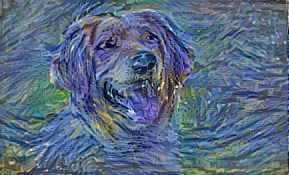

# 🎨 Neural Style Transfer

Make your photos look like famous paintings! Using AI to combine your photo with any artwork.

---

## 📸 Examples

### Example: Photo → Starry Night Style

| Photo | Style | Result |
|-------|-------|--------|
|  |  |  |


## ⚡ Quick Start

### 1️⃣ Install
```bash
pip install tensorflow numpy pillow scipy streamlit
```

### 2️⃣ Download VGG Model (500 MB)
```powershell
$url = "https://www.vlfeat.org/matconvnet/models/imagenet-vgg-verydeep-19.mat"
curl.exe -L -o imagenet-vgg-verydeep-19.mat $url
```

### 3️⃣ Run Web App
```bash
python -m streamlit run app.py
```

Open: **http://localhost:8502** 🌐

---

## 🎨 How to Use

**Web App (Easy!):**
1. Upload your photo
2. Upload an artwork
3. Click "Generate Stylized Image"
4. Download result ✨

**Command Line (Advanced):**
```bash
python neural_style.py --content photo.jpg --styles art.jpg --output result.jpg --iterations 500
```

---

## ⚙️ Settings

| Setting | Default | Tip |
|---------|---------|-----|
| **Iterations** | 100 | Higher = better (try 500) |
| **Content Weight** | 5.0 | Higher = keep original photo |
| **Style Weight** | 500.0 | Higher = stronger artistic style |
| **Learning Rate** | 10.0 | Speed of processing |
| **TV Weight** | 100.0 | Smoothness of output |

---

## 🛠️ Troubleshooting

| Problem | Solution |
|---------|----------|
| VGG model not found | Download model file (see above) |
| Slow processing | Use smaller images (400x400) |
| Memory error | Reduce iterations or image size |
| App won't start | Install: `pip install streamlit tensorflow` |

---

---

## 💡 Tips

✓ Use 400-600 pixel wide images (faster)  
✓ Try 500-1000 iterations for best results  
✓ Adjust weights to customize your style  
✓ Experiment with different artworks!

---

**Start creating beautiful artworks now!** 🎨✨
